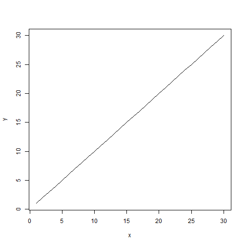

## How do i did it?

>1. First i took out the data from Reserve Bank Of India website and shorten       it for last thirty days.
>2. I then created a directory named pranjalm for my app.
>3. In main directory i created two new files ui.R and server.R.
>4. As we all know in ui.R three panels are there header,sidebar and main.
>5. In main panel, i put two tabbed sets showing data and plot.
>6. In sidebar, you can play with input with given options and also i use color for asthetics,to be input by user.

--- 

## Some graphical code to run 


```r
y <- c(1:30) 
x <- c(1:30)
fit <- lm(y ~ x)
plot(x,y,type="l")
```

 

---

## Why its better to use?

1. Its quit felxible and you can change data by locating a new csv file in server.R also very easy to make change.

2. This app is good for those who are from economical background.

3. Code written is quit easy to understand and can be changed accordingly to suit your application.

4. Also this code is totally self written plus learnt stuff, if you use it i will get encouraged.

---

## Last slide to see the code


```
## Loading required package: shiny
```

```
## Error: object 'ans' not found
```

<!--html_preserve--><div id="ans" class="control-group shiny-input-radiogroup">
<label class="control-label" for="ans">What is 2x2 equals to?</label>
<label class="radio ">
<input type="radio" name="ans" id="ans1" value="2" checked="checked"/>
<span>2</span>
</label>
<label class="radio ">
<input type="radio" name="ans" id="ans2" value="4"/>
<span>4</span>
</label>
<label class="radio ">
<input type="radio" name="ans" id="ans3" value="6"/>
<span>6</span>
</label>
<label class="radio ">
<input type="radio" name="ans" id="ans4" value="8"/>
<span>8</span>
</label>
</div><!--/html_preserve-->


